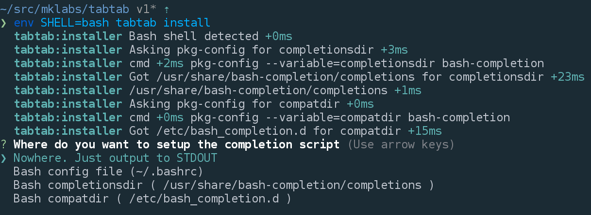
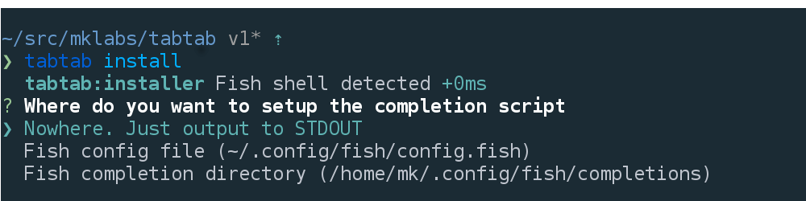

# tabtab [](http://travis-ci.org/mklabs/node-tabtab)

An npm package to do some custom command line`<tab><tab>` completion for any
system command, for bash/zsh/fish shells.

Made possible using the same technique as npm (whose completion is quite
awesome) relying on a bash/zsh completion shell script bridge to do the
actual completion from node's land.

## Install

    npm install tabtab --save

## Features

- Binary to manage and discover completion
- Automatic completion from help output
- `tabtab install` in package.json install script creates the completion file on user system
- Automatic completion with package.json `completion|tabtab` property

## Documentation

You can add completion pretty easily in your node cli script:

```js
// Ex. bin/ entry point for a "program" package
var tab = require('tabtab')();

// General handler. Gets called on `program <tab>` and `program stuff ... <tab>`
tab.on('program', function(data, done) {
  // General handler
  done(null, ['foo', 'bar']);
});

// Specific handler. Gets called on `program list <tab>`
tab.on('list', function(data, done) {
  done(null, ['file.js', 'file2.js']);
});

// Start must be called to register the completion commands and listen for
// completion.
tab.start();
```

These events are emitted whenever the command `program completion -- ..` is
triggered, with special `COMP_*` environment variables.

`tab.start()` will define two commands: `completion` and `completion-script`
for your program, the first is used by the Shell completion scripts, the second
is used to output the completion script to stdout.

The `data` object holds interesting value to drive the output of the
completion:

* `line`: full command being completed
* `words`: number of word
* `point`: cursor position
* `partial`: tabing in the middle of a word: foo bar baz bar foobar<tab><tab>rrrrrr
* `last`: last word of the line
* `lastPartial`: last partial of the line
* `prev`: the previous word

### Completion Install

#### Manual

Manually loading the completion for your cli app is done very much [like npm
does](https://docs.npmjs.com/cli/completion):

    . <(program completion-output)

It'll enables tab-completion for the `program` executable. Adding it to
your ~/.bashrc or ~/.zshrc will make the completions available
everywhere (not only the current shell).

    program completion >> ~/.bashrc

This requires an additional manual step for the user. Ideally we'd want it to
be automatic, and define it at a system-level.

#### Automatic

For completions to be active for a particular command/program, the user shell
(bash, zsh or fish) must load a specific file when the shell starts.

Each shell have its own system, and different loading paths. `tabtab` tries to
figure out the most appropriate directory depending on the `$SHELL` variable.

- **fish**  Uses `~/.config/fish/completions`
- **zsh**  Uses `/usr/local/share/zsh/site-functions`
- **bash** Asks `pkg-config` for completion directories if bash-completion is
  installed (defaults to `/usr/share/bash-completion/completions` and
  `/etc/bash_completion.d`)

`tabtab` CLI provides an `install` command to ease the process of installing a
completion script when the package is installed on the user system, using npm
script.

##### npm script:install

Using npm's install/uninstall script, you can automatically manage completion
for your program whenever it gets globally installed or removed.

```json
{
  "scripts": {
    "install": "tabtab install",
    "uninstall": "tabtab uninstall"
  }
}
```

On install, npm will execute the `tabtab install` command automatically in the
context of your package.

Ex.

```json
{
  "name": "foobar",
  "bin": "bin/foobar",
  "scripts": {
    "install": "tabtab install",
    "uninstall": "tabtab uninstall"
  },
  "dependencies": {
    "tabtab": "^1.0.0"
  }
}
```

Nothing is done's without asking confirmation, `tabtab install` looks at the
`$SHELL` variable to determine the best possible locations and uses
[Inquirer](https://github.com/SBoudrias/Inquirer.js/) to ask the user what it
should do:






## CLI

tabtab(1) - manage and discover completion on the user system.  It provides
utilities for install, removing a completion file, to discover and enable
additional completion etc.


    $ tabtab <command> [options]

    Options:
      -h, --help              Show this help output
      -v, --version           Show package version

    Commands:

      install                 Install and enable completion file on user system

<!--- uninstall               Undo the install command --->
<!--- list                    List the completion files managed by tabtab --->
<!--- search                  Search npm registry for tabtab completion files / dictionaries --->
<!--- add                     Install additional completion files / dictionaries --->
<!--- rm/remove               Uninstall completion file / dictionnary --->


### tabtab install

    $ tabtab install --help

    Options:
      --stdout                Outputs script to console and writes nothing
      --name                  Program name to complete
      --completer             Program that drives the completion (default: --name)


Triggers the installation process and asks user for install location. `--name`
if not defined, is determined from `package.json` name property. `--completer`
can be used to delegate the completion to another program. Ex.

    $ tabtab install --name bower --completer bower-complete

<!--- ### tabtab uninstall --->
<!---  --->
<!---     $ tabtab uninstall foobar --->
<!---  --->
<!--- Attemps to uninstall a previous tabtab install. `tabtab install` adds an entry --->
<!--- to an internal registry of completions, to be able to undo the operation on --->
<!--- uninstall. --->

`tabtab install` is not meant to be run directly, but rather used with your
`package.json` scripts.

## Credits

npm does pretty amazing stuff with its completion feature. Bash and zsh
provides command tab-completion, which allow you to complete the names
of commands in your $PATH.  Usually these functions means bash
scripting, and in the case of npm, it is partially true.

There is a special `npm completion` command you may want to look around,
if not already.

    npm completion

Running this should dump [this
script](https://raw.github.com/isaacs/npm/caafb7323708e113d100e3e8145b949ed7a16c22/lib/utils/completion.sh)
to the console. This script works with both bash/zsh and map the correct
completion functions to the npm executable. These functions takes care
of parsing the `COMP_*` variables available when hitting TAB to complete
a command, set them up as environment variables and run the `npm
completion` command followed by `-- words` where words match value of
the command being completed.

This means that using this technique npm manage to perform bash/zsh
completion using node and JavaScript. Actually, the comprehensiveness of npm
completion is quite amazing.

This whole package/module is based entirely on npm's code and @isaacs
work.

---

> [MIT](./LICENSE) &nbsp;&middot;&nbsp;
> [mkla.bz](http://mkla.bz) &nbsp;&middot;&nbsp;
> GitHub [@mklabs](https://github.com/mklabs) &nbsp;&middot;&nbsp;
> Twitter [@mklabs](https://twitter.com/mklabs)
